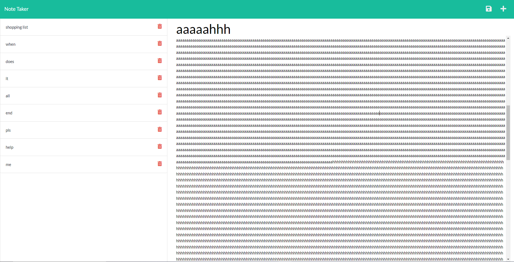

# MoesNoteTaker

# **
 MoesTeamGenerator 
**

## **Contents**
- [Description](#description)
- [Technologies](#technologies)
- [The Recipe](#the-recipe)
- [License](#license)
- [Shout Outs](#shout-outs)
- [Screen Shot](#screen-shot)
- [Links](#links)

 

## **Description**
Note taker which takes notes. 
  
You write a note and save it. If you dont like the note you can delete it with a button. notes.

## **Technologies**
- HTML, CSS, JavaScript, jQuery
- Bootstrap, FontAwesome
- Node.js
- Heroku
- Computer

## **The Recipe**
1. Clone this repo to the location of your choice
2. Open your command terminal in the root folder of the repo
3. Run `npm install`
4. Run `npm start`
5. Go the local host
6. Add some notes
7. Make no attempt to complete those tasks specified in the notes because you can't fail if you don't try
8. Delete some notes
9. Inner peace achieved

## **License**

MIT License, do what you want.  
The only crime that could possibly be comitted here would be actually using this note taker

## **Shout Outs**

Shout out to the real MVP, Stack Overflow

## **Screen Shot**

## **Links**

